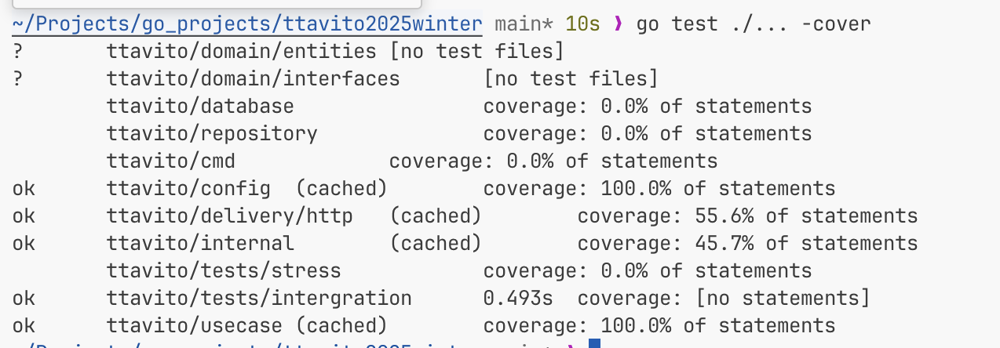
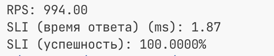
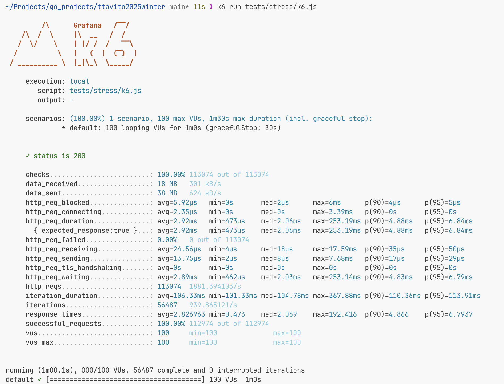

## Запуск проекта
```sh
docker compose up --build
```
Будет запущен postgres, после его полной готовности будет запущен сервер с ручками.<br>

Ручки работают в соответствии со [спецификацией](schema.yaml)<br>
Использован логгер slog<br>

## Статус заданий

- [x] Используйте этот [API](../schema.json) 
- [x] Сотрудников может быть до 100к, RPS — 1k, SLI времени ответа — 50 мс, SLI успешности ответа — 99.99%   
- [x] Для авторизации доступов должен использоваться JWT. Пользовательский токен доступа к API  выдается после авторизации/регистрации пользователя. При первой авторизации пользователь должен создаваться автоматически.
- [x] Реализуйте покрытие бизнес сценариев юнит-тестами. Общее тестовое покрытие проекта должно превышать 40%
- [x] Реализуйте интеграционный или E2E-тест на сценарий покупки мерча  
- [x] Реализуйте интеграционный или E2E-тест на сценарий передачи монеток другим сотрудникам


#### **Дополнительные задания**

- [x] Провести нагрузочное тестирование полученного решения и приложить результаты тестирования 
- [x] Реализовать интеграционное или E2E-тестирование для остальных сценариев  
- [x] Описать конфигурацию линтера (.golangci.yaml в корне проекта для go, phpstan.neon для PHP или ориентируйтесь на свои, если используете другие ЯП для выполнения тестового)


## Запуск тестов
**Запуск**<br>
```sh
go test ./...
```
**Вывод**<br>
<br>

**Комментарий**
* Выполнены интеграционные тесты к запущенному приложению и проверка всех сценариев.
* Протестировано отдельно сценарии в бизнес-логике (usecase)
* Протестированы иные функции для общего покрытия юнит-тестами проекта, оно превышает 40%

## Запуск стресс-теста
#### Самостоятельный стресс-тест
**Запуск**<br>
```sh
go run tests/stress/main.go
```
**Вывод**<br>
<br>
**Комментарий**<br>
Тест не очень объективный, но для самопроверки подходит. Не все ручки проверялись.<br>

#### K6 стресс-тест
Для начала нужно установить утилиту K6<br>
**Запуск**<br>
```sh
k6 run tests/stress/k6.js
```
**Вывод**<br>
<br>
**Комментарий**<br>
Мощный инструментов для локальных нагрузочных тестов.<br>

## Линтер
Сконфигурирован, отключены проверка ошибок и проверка неиспользуемых передаваемых аргументов. <br>

## Структура проекта
```txt
.
├── Dockerfile
├── README.md
├── cmd
│   └── main.go
├── config
│   ├── config.go
│   └── config_test.go
├── database
│   └── postgres.go
├── delivery
│   └── http
│       ├── handlers.go
│       ├── http.go
│       └── http_test.go
├── docker-compose.yml
├── domain
│   ├── entities
│   │   └── shop.go
│   └── interfaces
│       ├── db_pool.go
│       └── repository.go
├── go.mod
├── go.sum
├── internal
│   ├── jwt.go
│   ├── middleware.go
│   └── middleware_test.go
├── migrations
│   └── 0001_initial.up.sql
├── misc
│   ├── k6-stress-test.png
│   ├── self-stress-test.png
│   └── unit-test-results.png
├── repository
│   └── entity_repository.go
├── schema.json
├── schema.yaml
├── task
│   └── INFO.md
├── tests
│   ├── intergration
│   │   └── intergration_test.go
│   └── stress
│       ├── k6.js
│       └── main.go
└── usecase
    ├── usecase.go
    └── usecase_test.go
```